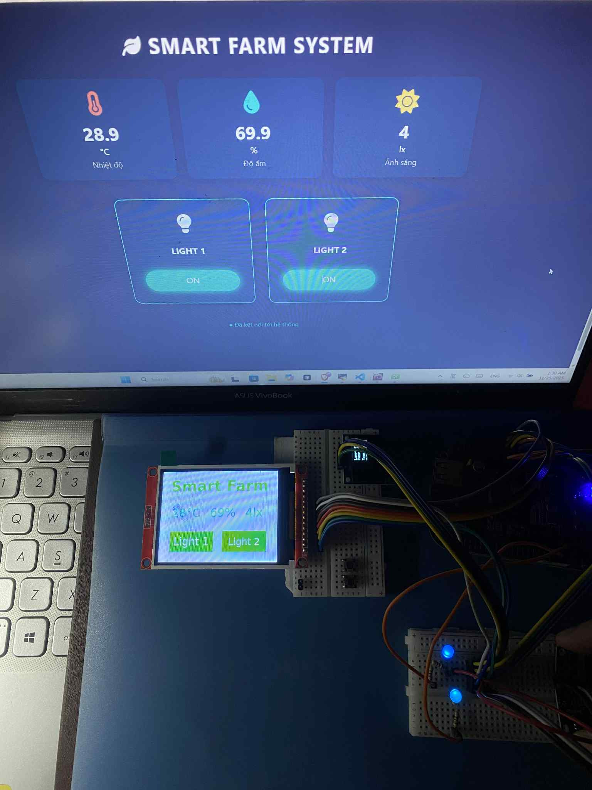
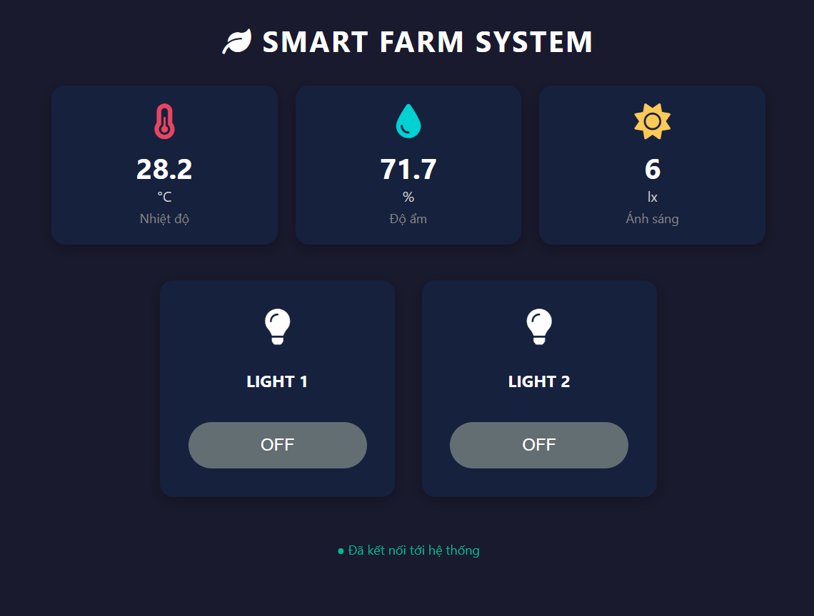

# 🌱 Smart Farm IoT System based on BeagleBone Black & Qt5

A comprehensive IoT solution for agricultural environment monitoring and control, built on the **BeagleBone Black** embedded platform using **C++** and **Qt5**.

*(Image: Full system in action running on BeagleBone Black and Qt GUI on Host)*

## 📖 Overview

This project implements a "Smart Farm" supervisor system that monitors environmental parameters (Temperature, Humidity, Light Intensity) in real-time and controls actuators.

The system features a **Hybrid Architecture**:
1.  **Local Supervisor:** An SSD1306 OLED display connected directly to the BeagleBone Black provides on-site status monitoring independent of the network.
2.  **Remote GUI:** A Qt5 Desktop Application acts as a dashboard to visualize data and send control commands via MQTT.

## 🚀 Key Features

* **Real-time Monitoring:**
    * Temperature & Humidity via **SHT30/SHT3x** sensor.
    * Light Intensity (Lux) via **BH1750** sensor.
* **Actuator Control:**
    * Control Grow Lights (via GPIO).
    * Manual control from the Qt Dashboard.
* **Local Display (Supervisor Mode):**
    * 0.96" OLED (SSD1306) displays current sensor values and device status.
    * Custom C++ I2C driver implementation.
* **Connectivity:**
    * **MQTT Protocol** for communication between the Embedded Device and the Control Dashboard.
    * Custom I2C Userspace Drivers for sensor integration.

## 🛠 Hardware Architecture

| Component | Model | Interface | Description |
| :--- | :--- | :--- | :--- |
| **Main Board** | BeagleBone Black | - | Running Yocto/Debian Linux |
| **Temp/Hum Sensor** | SHT30 | I2C (0x44) | Measures environment metrics |
| **Light Sensor** | BH1750 | I2C (0x23) | Measures brightness in Lux |
| **Display** | SSD1306 | I2C (0x3C) | 128x64 OLED Display |
| **Actuators** | LEDs | GPIO |

### 🔌 Pinout Configuration

* **ILI9341 (SPI):**
    * CS: `P9_28`
    * Reset: `P9_25`
    * DC: `P9_27`
    * MOSI: `P9_30`
    * SCK: `P9_31`
    * MISO: `P9_29`
* **I2C Bus (I2C1):**
    * SCL: `P9_17`
    * SDA: `P9_18`
* **GPIO Actuators:**
    * Light Control: `P8_7` 
    * Pump Control: `P8_8` 

## 💻 Software Tech Stack

* **Language:** C++
* **Framework:** Qt 5.15 (Modules: `QtWidgets`, `QtMqtt`)
* **Build System:** CMake
* **Embedded Linux:** Yocto Project / Debian

### 1. The Control Dashboard (Qt GUI)
Displays sensor data in real-time and provides toggle buttons for the farm equipment.

## ⚙️ Installation & Build

### Prerequisites

* **Hardware:** BeagleBone Black, Sensors mentioned above.
* **Software:** Qt5 Development Kit, CMake.

### Build Steps

1.  **Configure Device Tree (BeagleBone Black):**

2.  **Build with CMake:**

3.  **Run the application:**

## 🧠 Project Structure

├── main.cpp # Application entry point 
├── mainwindow.cpp/h # Qt GUI Logic & MQTT handling 
├── gpio.cpp/h # Wrapper for libgpiod 
├── light_sensor.cpp/h # BH1750 I2C Driver 
├── temperature_sensor.cpp/h # SHT30 I2C Driver 
├── ssd1306.cpp/h # OLED Display Driver & Font rendering 
└── CMakeLists.txt # Build configuration